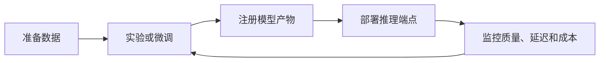

# AWS SageMaker：从实验到部署的机器学习工作台

AWS SageMaker 解决的是“模型怎么训练、微调、部署和运维”的问题。它不只是一个推理 API，而是一套围绕数据、训练任务、托管端点、基础模型和 MLOps 的云平台。

## 它和普通模型 API 有什么不同

前面你已经见过 OpenAI、Claude、Gemini 这类模型 API。模型 API 的典型用法是：选模型，传 Prompt，拿结果。SageMaker 的视角更靠近模型工程生命周期：数据准备、训练、调参、部署、监控和成本管理都在平台里。

developer-roadmap 图谱把这个节点标为 `AWS Sagemaker`，同 ID 源文件标题是 Meta Llama。这里继续按图谱 label 写 SageMaker，同时保留源文件关于开源模型的核心：在 SageMaker 里，你可以使用 JumpStart 或模型目录接触 Llama 等基础模型，把它们部署到 AWS 管理的环境中。

可以先用这个表区分两种心智模型：

| 维度 | 模型 API | AWS SageMaker |
| --- | --- | --- |
| 主要问题 | 怎么调用一个现成模型 | 怎么管理模型生命周期 |
| 起步方式 | 发一次 HTTP 或 SDK 请求 | 创建 notebook、训练任务、模型或端点 |
| 常见输出 | 一段文本、JSON、图片或向量 | 训练产物、部署端点、监控指标 |
| 更适合 | 快速接入通用模型能力 | 需要自有训练、微调、部署和 AWS 治理的团队 |

## SageMaker 里常见的工作流

SageMaker 的入口很多，初学时容易觉得散。你可以先抓住一条主线：把模型从实验推进到可调用的服务。

这条线下面有很多具体工具。SageMaker Studio 提供开发环境；Training Jobs 负责托管训练；Automatic Model Tuning 用来调参；Endpoints 负责在线推理；Batch Transform 适合离线批量预测；Model Monitor 观察数据和模型质量漂移。做生成式 AI 时，JumpStart 可以帮你发现、评估和部署基础模型。

## 工程里要注意的事

SageMaker 的优势在控制权。你可以选择实例类型、网络、IAM 权限、训练脚本、容器镜像、端点扩缩容策略和监控方式。对有 AWS 基础设施的团队来说，这些能力能和 S3、ECR、CloudWatch、VPC、KMS 等服务接起来。

控制权也意味着更多工程成本。一个托管端点长时间开着就会持续计费；训练任务失败可能来自权限、镜像、数据路径、实例配额或脚本问题；基础模型部署还会受到显存、冷启动和吞吐限制影响。AI Engineer 使用 SageMaker 时，要把成本和可运维性当成设计输入，而不是上线后再补。

SageMaker 不一定适合每个 AI 应用。如果只是做一个内部文档问答原型，直接调用托管模型 API 可能更快。如果你要在 AWS 里管理自有模型、微调开源模型、部署私有推理端点，SageMaker 才开始显示出价值。

## 怎么开始用

最小学习路径可以从 SageMaker Studio 和 JumpStart 开始。先在 Studio 里打开一个示例 notebook，跑通一个小模型或基础模型部署，再观察它创建了哪些资源：S3 数据、训练任务、模型对象、端点和日志。

接下来可以做一个更接近真实项目的小练习：

1. 选一个小数据集，放到 S3。
2. 用 SageMaker 训练或微调一个模型。
3. 部署一个实时端点，只保留最小实例规格。
4. 发几次测试请求，记录延迟、错误、输出质量和费用。
5. 删除端点，避免空跑计费。

最后一步很实在。SageMaker 的学习成本里，账单也是一部分。你越早养成资源生命周期意识，后面越不容易被云端实验拖住。

## 延伸阅读

- [AWS Docs：What is Amazon SageMaker AI?](https://docs.aws.amazon.com/sagemaker/latest/dg/whatis.html)
- [AWS Docs：Amazon SageMaker Studio](https://docs.aws.amazon.com/sagemaker/latest/dg/studio.html)
- [AWS Docs：SageMaker JumpStart](https://docs.aws.amazon.com/sagemaker/latest/dg/studio-jumpstart.html)
- [AWS Docs：Deploy models for inference](https://docs.aws.amazon.com/sagemaker/latest/dg/deploy-model.html)
- [AWS Docs：Train a model with Amazon SageMaker](https://docs.aws.amazon.com/sagemaker/latest/dg/how-it-works-training.html)
- [AWS Docs：Monitor data and model quality](https://docs.aws.amazon.com/sagemaker/latest/dg/model-monitor.html)
- [nilbuild/developer-roadmap：meta-llama@OkYO-aSPiuVYuLXHswBCn.md](https://github.com/nilbuild/developer-roadmap/blob/master/src/data/roadmaps/ai-engineer/content/meta-llama%40OkYO-aSPiuVYuLXHswBCn.md)
