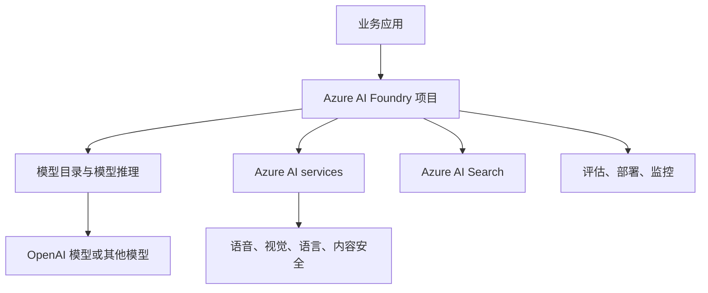

# Azure AI：把模型、工具和治理放进同一个工程平台

Azure AI 更像一组云端 AI 工程能力，而不是某一个模型。你可以用它调用模型、接入搜索和内容安全，也可以把评估、部署、权限和监控放到同一套 Azure 环境里管理。

## 它解决什么问题

前面几节讲的是模型、Prompt、上下文和 token。真正做产品时，你还会碰到另一类问题：模型从哪里来，API 怎么管，日志放在哪里，安全策略谁来配置，企业数据能不能留在受控环境里。

Azure AI Foundry 和 Azure AI services 面向的就是这类问题。developer-roadmap 图谱把这个节点标为 `Azure AI`，同 ID 源文件却是 OpenAI Models。这里按图谱顺序讲 Azure AI，同时保留源文件里关于 OpenAI 模型 API 化使用的核心：你不是下载一个模型到本地，而是通过云平台把模型能力接进应用。

对 AI Engineer 来说，Azure AI 的价值通常不在“换一个聊天界面”，而在把模型调用接入企业已有的云资源：

| 场景 | Azure AI 能提供什么 |
| --- | --- |
| 已经使用 Azure 的团队 | 身份、网络、日志、密钥和部署环境可以沿用现有治理方式 |
| 要调用多类模型 | 在模型目录里选择 OpenAI、开源模型或其他供应商模型 |
| 需要内容安全 | 用 Azure AI Content Safety 做文本和图像风险检测 |
| 要把企业知识接入模型 | 结合 Azure AI Search 做检索、索引和文档召回 |
| 要上线生产应用 | 在项目里管理评估、部署、访问控制和观测数据 |

## 平台里有哪些能力

理解 Azure AI 时，可以先把它拆成三层。第一层是模型能力，包括 Azure OpenAI、模型目录和模型推理接口。第二层是 AI services，比如 Speech、Vision、Language、Translator、Document Intelligence 和 Content Safety。第三层是工程管理能力，也就是 Azure AI Foundry 里的项目、评估、部署、连接器和监控。

这三层不一定每个项目都用满。一个客服摘要功能可能只需要 Azure OpenAI 加日志；一个企业知识助手可能会同时用 Azure AI Search、模型推理、内容安全和评估。平台能力越多，工程边界越要清楚，否则很容易把“能接入”误解成“适合接入”。

## 工程里要注意的事

Azure AI 最适合已经有云治理要求的团队。比如公司要求网络隔离、权限审计、统一账单和合规审查，直接用公共模型 API 往往会遇到组织层面的阻力。Azure 的优势是把 AI 能力放进同一个云控制面里。

代价是配置面也会变多。资源组、区域、模型部署名、配额、身份权限、私有网络和内容过滤策略都可能影响一次 API 调用。排查问题时，不要只盯 SDK 代码；很多故障来自云资源配置、区域可用性或配额限制。

模型选型也要具体到任务。生成文本、抽取结构化字段、语音转文字、图像理解和内容审核不是同一个问题。Azure AI 里能找到很多能力，但 AI Engineer 的工作是把任务拆清楚，再决定用模型、专用服务，还是两者组合。

## 怎么开始用

如果你只是想快速验证一个模型调用，可以从 Azure AI Foundry 的模型目录或 Azure OpenAI 文档开始。先创建项目和资源，再部署一个模型，最后用 SDK 或 REST API 发起最小请求。

如果你要做企业知识问答，起步顺序可以更稳一点：

1. 先确认数据能不能进入 Azure 环境，以及是否需要私有网络。
2. 用 Azure AI Search 建一个小索引，只放 20 到 50 篇代表性文档。
3. 用模型推理接口接入问答，并记录输入、检索片段、输出和 token 用量。
4. 加上内容安全和基础评估，再决定是否扩大文档范围。

这个顺序的好处是风险暴露得早。数据权限、检索质量、模型成本和内容安全都能在小样本里先看到，不必等到系统搭大后再返工。

## 延伸阅读

- [Microsoft Learn：What is Azure AI Foundry?](https://learn.microsoft.com/en-us/azure/ai-foundry/what-is-azure-ai-foundry)
- [Microsoft Learn：Azure AI Foundry Models](https://learn.microsoft.com/en-us/azure/ai-foundry/foundry-models/)
- [Microsoft Learn：Azure OpenAI Service documentation](https://learn.microsoft.com/en-us/azure/ai-services/openai/)
- [Microsoft Learn：Azure AI services documentation](https://learn.microsoft.com/en-us/azure/ai-services/)
- [Microsoft Learn：Azure AI Content Safety](https://learn.microsoft.com/en-us/azure/ai-services/content-safety/)
- [Microsoft Learn：Azure AI Search documentation](https://learn.microsoft.com/en-us/azure/search/)
- [nilbuild/developer-roadmap：openai-gpt-o-series@3PQVZbcr4neNMRr6CuNzS.md](https://github.com/nilbuild/developer-roadmap/blob/master/src/data/roadmaps/ai-engineer/content/openai-gpt-o-series%403PQVZbcr4neNMRr6CuNzS.md)
