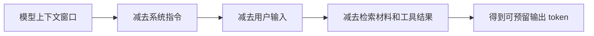

# 怎么做 Token Counting：先算容量，再发请求

Token Counting 的目标很朴素：在调用模型前估算输入和输出会占多少 token，避免请求超限、答案截断、延迟失控或成本失真。它是 AI 应用里最早该接入的基础观测能力之一。

## 第一步：先分清要数什么

Token 不是汉字数、英文单词数，也不是 JSON 字符数。模型会用自己的 tokenizer 把文本拆成 token；不同模型的拆法可能不同。同一段中文、代码、空格、emoji 或多语言混排，在不同 tokenizer 下数量都可能变。

developer-roadmap 图谱把这个节点标为 `Token Counting`，同 ID 源文件标题是 Top-P Sampling。Top-P 控制生成时候选 token 的累计概率范围；Token Counting 关心的是一次请求会消耗多少 token。两者都和 token 有关，但一个是生成策略，一个是容量和成本管理。

先把一次请求拆成四块：

| 部分 | 要不要计入 | 为什么 |
| --- | --- | --- |
| system / developer 指令 | 要 | 这些指令随请求一起进入上下文 |
| 用户问题 | 要 | 这是模型理解任务的主要输入 |
| 检索材料和工具结果 | 要 | 它们经常是 token 暴涨的来源 |
| 预留输出 | 要估算 | 输出不在请求正文里，但会占用上下文和费用 |

## 第二步：用模型对应的 tokenizer

最稳的做法是使用供应商提供或推荐的计数方式。OpenAI 常用 `tiktoken` 和 cookbook 示例；Anthropic 提供 Messages API 的 token 计数接口；Gemini API 有 count tokens 能力；Hugging Face 生态通常用对应模型的 tokenizer。

不要用“中文约等于 1 字 1 token”这类粗略规则做生产判断。粗略估算可以帮你早期判断量级，但不能替代上线前的真实计数。Prompt 里一旦混入代码、Markdown 表格、长 JSON 或多语言文本，误差会变得很明显。

## 第三步：给输入和输出分别设预算

把 token 预算写成代码里的显式规则，而不是散落在 Prompt 文案里。一个常见做法是先固定模型上下文窗口，再减去系统指令、用户输入和检索材料，最后得到可用输出空间。

如果可预留输出太少，不要硬发请求。你可以减少检索片段、压缩上下文、分批处理，或者换一个上下文窗口更大的模型。对 AI Engineer 来说，Token Counting 的价值不只是算账，而是提前发现任务设计已经超出模型容量。

## 验证：怎么知道做对了

先用 10 到 20 个真实样例跑一遍计数。记录输入 token、预留输出 token、实际输出 token、截断状态和接口返回的 usage 字段。估算值和供应商返回值不一定完全相同，但差距应该可解释。

生产环境里至少记录这些字段：

- 模型名和版本。
- 输入 token、输出 token、总 token。
- 是否因为长度上限停止。
- 请求延迟和单次成本估算。
- 检索材料或工具结果占用的 token。

这些数据会直接影响后续优化。比如成本突然升高，可能是检索片段变长；延迟变慢，可能是输出上限过宽；答案频繁截断，可能是预留输出空间不够。

## 延伸阅读

- [OpenAI Cookbook：How to count tokens with tiktoken](https://cookbook.openai.com/examples/how_to_count_tokens_with_tiktoken)
- [OpenAI Docs：Text generation](https://platform.openai.com/docs/guides/text)
- [Anthropic Docs：Messages API token counting](https://docs.anthropic.com/en/docs/build-with-claude/token-counting)
- [Google AI for Developers：Token counting](https://ai.google.dev/gemini-api/docs/tokens)
- [Hugging Face Docs：Summary of the tokenizers](https://huggingface.co/docs/transformers/en/tokenizer_summary)
- [Hugging Face Course：Tokenizers](https://huggingface.co/learn/llm-course/chapter2/4)
- [nilbuild/developer-roadmap：top-p@FjV3oD7G2Ocq5HhUC17iH.md](https://github.com/nilbuild/developer-roadmap/blob/master/src/data/roadmaps/ai-engineer/content/top-p%40FjV3oD7G2Ocq5HhUC17iH.md)
