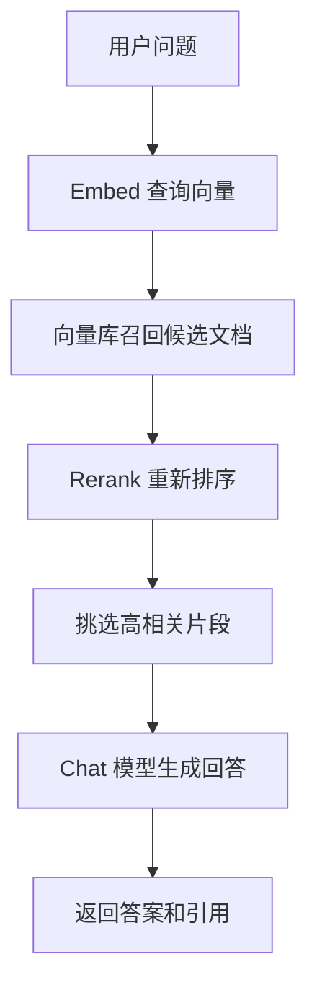

# Cohere：面向企业检索和生成的模型平台

Cohere 适合放在“模型供应商”这一层理解：它提供可通过 API 调用的闭源模型，也提供 Embed、Rerank、Chat 等围绕企业文本任务设计的能力。对 AI Engineer 来说，Cohere 的重点不是“又一个聊天模型”，而是把生成、语义表示和排序接到同一条业务链路里。

## 它解决什么问题

前面你已经见过 Hugging Face Models、成本估算和 Mistral AI。Cohere 处在另一个常见选型位置：团队想用托管模型 API，少碰训练和底层推理，又希望在检索、排序、多语言和企业数据场景上有更完整的工具。

developer-roadmap 原文把 Cohere 介绍为一套闭源大语言模型，覆盖多种自然语言处理任务。开发者可以通过 API 使用这些模型，不必从零训练和微调。Cohere 也强调企业级 NLP 方案，关注安全、可靠性和集成便利性。

这段核心介绍可以再往工程里推一步：Cohere 的价值不只在回答问题，还在“先找到合适材料，再让模型回答”。很多企业 AI 应用不是开放聊天，而是客服知识库、合同检索、内部文档问答、销售线索归类和内容审核辅助。这类场景里，检索质量经常比模型本身更先决定体验。

## 主要能力怎么分

Cohere 的模型能力可以按链路拆开看。Chat 模型负责生成、总结、抽取和对话；Embed 模型把文本、图片或混合输入变成向量，方便做相似度检索；Rerank 模型把候选文档按与问题的相关性重新排序。

这个组合适合文档问答。你可以先用向量检索找出几十段候选内容，再用 Rerank 把最相关的几段排到前面，最后交给 Chat 模型生成回答。这样做比“只靠向量相似度”更稳，因为 Rerank 会重新读问题和候选文档之间的具体关系。

如果你的应用只是改写一段文案，Chat API 就够了。如果你的应用要从公司文档里找答案，Embed 和 Rerank 会变成主角。

## 工程里要看哪些边界

Cohere 的企业定位不代表你可以跳过评估。模型供应商的稳定性要落到具体任务上：中文、英文、代码、长文档、表格、PDF、客服对话，每一种输入都会改变效果。

Rerank 也不是免费的提升。它会增加一次模型调用、延迟和费用。候选文档越多，排序越贵；候选文档太少，排序又可能救不回召回阶段漏掉的内容。比较合理的做法是先建立一个小评测集，记录问题、正确材料、召回结果、排序结果和最终回答。

部署方式也要提前看。Cohere 可以通过自家 API 使用，也能通过 Amazon Bedrock、SageMaker 等平台接入部分模型。不同入口会影响模型版本、区域、权限、账单和日志策略。生产环境里要把这些差异写进配置，而不是散在代码里。

## 怎么开始用

最小起步可以选一个企业文档问答任务。准备 30 个真实问题，每个问题标注一两段正确材料。先做普通向量召回，再加上 Rerank，比较命中率、回答质量、延迟和成本。

如果你只是评估 Cohere 的 Chat 模型，可以先选一个稳定的业务任务，比如“把客户反馈归类成 JSON”。不要一开始就比较十个模型。先用一个模型把输入、输出、错误样例和成本记录下来，再换模型或换供应商，结果才有可比性。

## 延伸阅读

- [Cohere Documentation](https://docs.cohere.com/v2)
- [Cohere Docs：Models overview](https://docs.cohere.com/v2/docs/models/)
- [Cohere Docs：Chat API](https://docs.cohere.com/v2/reference/chat)
- [Cohere Docs：Embed API](https://docs.cohere.com/v2/reference/embed)
- [Cohere Docs：Rerank API](https://docs.cohere.com/v2/reference/rerank)
- [Cohere：Models overview](https://cohere.com/models-overview)
- [nilbuild/developer-roadmap：cohere@a7qsvoauFe5u953I699ps.md](https://github.com/nilbuild/developer-roadmap/blob/master/src/data/roadmaps/ai-engineer/content/cohere%40a7qsvoauFe5u953I699ps.md)
