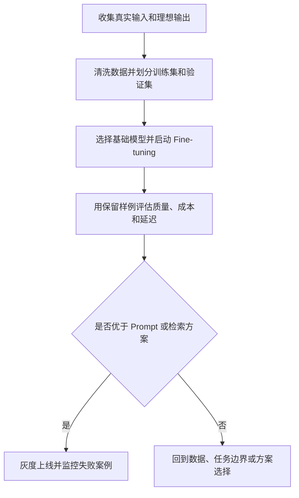

# Fine-tuning：让预训练模型贴近你的任务

Fine-tuning 是把已经训练好的 LLM 再用一小批任务数据继续训练，让模型更习惯你的领域、格式和判断标准。它不是“让模型知道更多资料”的默认办法；如果问题主要是缺少最新知识，先考虑检索和上下文设计。

## 它解决什么问题

Fine-tuning 适合解决“同一类任务反复出现，但 prompt 越写越长”的问题。比如你要把客服工单稳定分类成固定标签，或让模型始终按公司内部语气改写一段回复。靠 prompt 可以起步，但样例越来越多后，请求会变长，成本和延迟也会上升。

developer-roadmap 对 Fine-tuning 的核心介绍是：它会拿预训练 LLM，在更小、更具体的数据集上继续训练，让模型在某个任务或领域上表现更好。这个判断很重要，因为 Fine-tuning 改的是模型行为，而不是临时塞一段资料给模型看。

更实际的说法是：Fine-tuning 让模型把你的“示例”吸收到参数里。上线后，你可以用更短的 prompt 触发类似行为，而不是每次都把几十个示例发给模型。

## 什么时候值得做

Fine-tuning 适合高频、边界清楚、评价标准稳定的任务。你能提前收集输入、理想输出和坏例子，也能说清楚什么算好结果。没有这些数据，Fine-tuning 很容易把噪声学进去。

常见适用场景包括：

- 固定格式抽取，例如从合同里抽取条款类型和风险等级。
- 稳定风格生成，例如客服回复、销售邮件、品牌文案。
- 分类和路由，例如把用户问题分到不同处理队列。
- 领域语言适配，例如医疗、法律、金融里的专有表达。

如果任务每次都依赖新文档、新库存、新政策，Fine-tuning 通常不是第一选择。模型训练完以后不会自动知道新资料，仍然需要你把最新上下文交给它。

## 工作原理

Fine-tuning 的工程流程可以理解为四步：准备数据、训练、评估、上线监控。最难的通常不是训练命令，而是把数据整理成稳定、干净、可复现的样子。

训练数据要尽量接近线上请求。格式、语气、字段名、边界案例都要像真实世界一样出现。只用“完美样例”训练，模型上线后遇到脏输入会很脆。

## 工程里要注意的事

Fine-tuning 的成本不只在训练。你还要维护数据版本、训练配置、评估集、模型版本和回滚方案。模型一旦进入生产，后续每次新增数据都可能变成一次小型发布。

和 Prompt Engineering 比，Fine-tuning 的优势是稳定、短 prompt、长期成本可能更低。限制也很清楚：数据准备慢，实验周期长，错误会被“固化”进模型行为里。

和检索方案比，Fine-tuning 更适合学格式、语气、偏好和分类边界。检索更适合接入事实、文档和经常变化的知识。很多成熟系统会把两者组合起来：Fine-tuning 负责稳定行为，检索负责提供最新材料。

## 怎么开始用

先不要急着训练模型。拿 50 到 100 条真实样例，用普通 prompt 做一个基线，记录准确率、格式错误、延迟和单次成本。基线能让你判断 Fine-tuning 到底有没有收益。

然后准备一份小但干净的数据集。每条样例只表达一个清楚的任务，不把多个目标混在一起。训练后用没有参与训练的样例评估，重点看失败类型有没有减少，而不是只看几条好看的输出。

下一步可以进入 `Prompt Injection Attacks`。Fine-tuning 改变模型行为，但不能自动解决恶意输入和数据泄露问题；安全边界要在应用层一起设计。

## 延伸阅读

- [OpenAI Docs：Fine-tuning](https://platform.openai.com/docs/guides/fine-tuning)
- [Hugging Face Docs：Fine-tune a pretrained model](https://huggingface.co/docs/transformers/training)
- [Hugging Face PEFT：LoRA](https://huggingface.co/docs/peft/main/en/conceptual_guides/lora)
- [Google Cloud：Supervised fine-tuning for generative AI](https://cloud.google.com/vertex-ai/generative-ai/docs/models/tune-models)
- [IBM Think：What is fine-tuning?](https://www.ibm.com/think/topics/fine-tuning)
- [nilbuild/developer-roadmap：fine-tuning@zTvsCNS3ucsZmvy1tHyeI.md](https://github.com/nilbuild/developer-roadmap/blob/master/src/data/roadmaps/ai-engineer/content/fine-tuning%40zTvsCNS3ucsZmvy1tHyeI.md)
