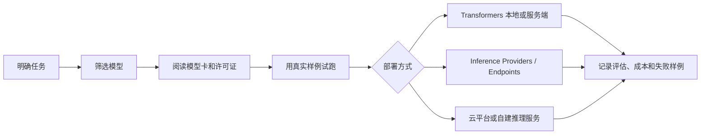

# Hugging Face Models：先从任务和模型卡判断能不能用

Hugging Face Models 不是一个单独模型，而是一个模型目录和协作平台。你可以在里面找到文本、图像、音频、多模态等任务的预训练模型，但真正能不能放进工程里，要看任务匹配、模型卡、许可、推理方式和维护状态。

## 它解决什么问题

前面你已经见过 OpenAI、Claude、Gemini 这类直接通过 API 使用的模型。Hugging Face Models 解决的是另一类问题：你想比较更多开源或开放模型，想用现成模型做分类、摘要、Embedding、图像理解，或者想把模型下载到自己的环境里部署。

developer-roadmap 对 Hugging Face Models 的核心介绍是：Hugging Face 平台提供大量预训练机器学习模型，覆盖自然语言处理、计算机视觉和音频处理等任务。平台上有文本分类、翻译、摘要、问答等模型，也有 BERT、GPT、T5、CLIP 这类常见模型家族。开发者可以通过工具和 API 使用、微调、部署这些模型，也可以在社区里共享和改进模型。

这段介绍适合做第一层理解。工程里还要补一句：Hugging Face Models 更像一个模型市场和模型仓库，不是质量保证书。一个模型能被搜到，只说明它被发布在 Hub 上；能不能用于你的业务，要继续检查模型卡、数据来源、许可证、任务标签、推理成本和真实样例表现。

## 模型页面里先看什么

理解 Hugging Face Models 的关键，是先学会读模型页面。不要一上来就复制 `from_pretrained`，先判断这个模型是不是在解决你的问题。

| 位置 | 你要看什么 | 为什么重要 |
| --- | --- | --- |
| Task 标签 | 文本生成、文本分类、图像分类、Feature Extraction 等 | 先确认模型和任务类型一致 |
| Model card | 训练数据、适用场景、限制、评估结果、许可证 | 判断模型是否适合进入业务系统 |
| Files and versions | 权重文件、配置、Tokenizer、提交历史 | 确认模型是否可复现、是否还在维护 |
| Inference widget / Providers | 能否在线试跑，由哪个提供商托管 | 快速验证样例，但不要替代正式评估 |
| License | Apache-2.0、MIT、自定义许可等 | 决定能否商用、能否再分发或微调 |

模型卡很容易被忽略。它通常会写模型训练目标、数据来源、评估指标和限制。如果模型卡很空，或者只写了宣传式描述，你就缺少判断依据。生产项目里，这类模型要么只做实验，要么补充自己的评估和风险记录。

## 怎么把模型接进工程

选中模型以后，接入方式大致有三种。第一种是用 Transformers 在本地或服务器上加载模型。它适合你想控制推理环境、需要微调，或者要把模型放进已有 Python 服务。

第二种是通过 Hugging Face Inference Providers 或 Inference Endpoints 调用托管推理。它更接近普通 API 使用方式，适合快速验证、低运维接入，或者暂时不想自己管 GPU。

第三种是把模型部署到云平台或自己的推理服务里，例如 SageMaker、自建容器、Kubernetes 或专门的推理平台。这条路需要更多工程工作，但你能更细地控制成本、权限、延迟和数据边界。

这里的判断点不只是“能不能跑”。你还要看模型大小、显存需求、Tokenizer、输入长度、输出格式、吞吐、冷启动、依赖版本和升级节奏。一个 70B 模型可能很强，但如果你的任务只是把评论分成正面和负面，小模型或专用分类模型可能更稳、更便宜。

## 工程里要注意的事

Hugging Face 的优势是选择多，代价也是选择多。模型越多，越需要固定评估流程。你可以先准备 30 到 100 条真实样例，覆盖正常输入、边界输入和失败输入，再比较不同模型的结果。

开源或开放权重也不等于没有成本。你省下了按 token 付费的一部分费用，但会多出 GPU、部署、监控、扩缩容、依赖升级和安全审查。对于小流量或需求不稳定的功能，托管 API 往往更省事；对于高流量、强隐私或需要深度定制的场景，自部署才可能更划算。

还有一个实际问题：模型页面上的 benchmark 只能做参考。你的产品可能关心的是中文客服口径、代码补全风格、内部文档问答，或者图像审核边界。公开榜单无法替你证明这些事情。

## 怎么开始用

如果你是第一次用 Hugging Face Models，可以按一个很轻的流程开始：

1. 在 Models 页面按任务筛选，比如 Text Classification、Text Generation、Feature Extraction。
2. 选择下载量较高、模型卡完整、许可证清楚的模型。
3. 用 Inference widget 或最小代码跑 10 条真实样例。
4. 记录模型名称、版本、输入、输出、延迟和明显失败点。
5. 再决定是继续用托管推理，还是下载模型进入自己的服务。

这一步的目标不是立刻上线，而是建立判断手感：什么任务适合直接用现成模型，什么任务需要微调，什么任务其实更适合调用商业模型 API。

## 延伸阅读

- [Hugging Face Docs：Models](https://huggingface.co/docs/hub/en/models)
- [Hugging Face Docs：Model Cards](https://huggingface.co/docs/hub/en/model-cards)
- [Hugging Face Docs：Inference Providers](https://huggingface.co/docs/inference-providers/en/index)
- [Hugging Face Transformers：Pipelines](https://huggingface.co/docs/transformers/en/main_classes/pipelines)
- [Hugging Face Course：Using pretrained models](https://huggingface.co/learn/llm-course/chapter2/2)
- [nilbuild/developer-roadmap：hugging-face-models@EIDbwbdolR_qsNKVDla6V.md](https://github.com/nilbuild/developer-roadmap/blob/master/src/data/roadmaps/ai-engineer/content/hugging-face-models%40EIDbwbdolR_qsNKVDla6V.md)
