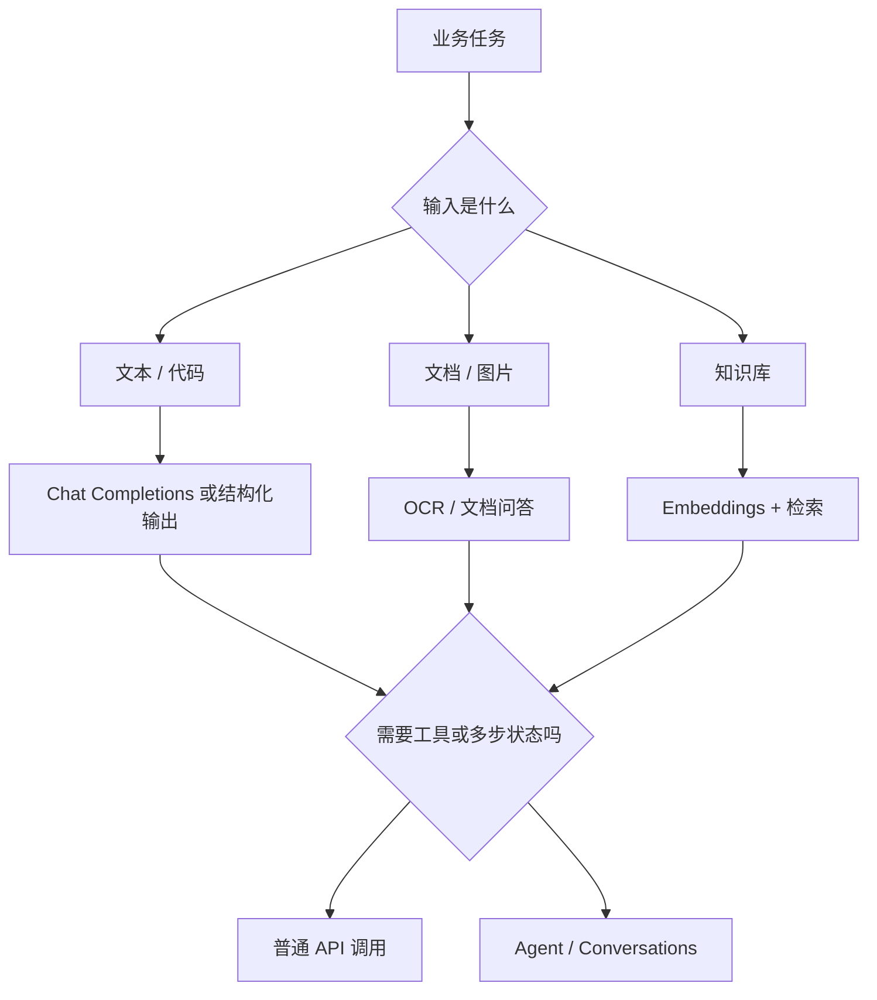

# Mistral AI：开放权重和商业 API 之间的模型平台

Mistral AI 的特点不是“又一个聊天模型供应商”，而是同时提供商业 API、开放权重模型和多种部署方式。你可以像调用普通模型 API 一样使用它，也可以在合适场景下选择开放权重模型做自部署。

## 它解决什么问题

在 OpenAI、Claude、Gemini 之外，AI Engineer 还需要理解其他模型供应商。原因很现实：不同模型在价格、速度、上下文、代码能力、多模态、部署区域、数据边界和开放程度上差异很大。

developer-roadmap 原文把 Mistral AI 定义为一家专注于开放权重大语言模型的公司，目标是提供高性能 AI 方案。Mistral 的模型适合文本生成、翻译、摘要等自然语言任务。开放权重让开发者能更灵活地定制和部署，也让模型透明度和可访问性更高。

这段介绍抓住了 Mistral 的一个核心点：开放权重。但现在看 Mistral，不能只看开源模型。它还有 La Plateforme API、商业模型、Embedding、OCR、结构化输出、函数调用、Agent、批处理，以及云部署和自部署选项。对工程选型来说，Mistral 更像一个模型平台。

## Mistral 和普通模型 API 有什么不同

如果你只想快速生成文本，Mistral 可以像其他供应商一样通过 Chat Completions API 调用。你给 messages，设置模型和参数，拿到回答。这个层面很容易理解。

差异在于部署和开放程度。Mistral 提供开放权重模型，也提供商业闭源或受控模型。开放权重适合你需要更强控制权、特定部署环境、内部安全审查，或者想把模型放到自己的基础设施里。商业 API 则适合快速接入、少运维和持续获得供应商更新。

| 选择 | 适合场景 | 代价 |
| --- | --- | --- |
| La Plateforme API | 快速接入文本、代码、Embedding、OCR、Agent 能力 | 受供应商价格、速率限制和区域影响 |
| Cloud 部署 | 想在指定云环境里使用模型能力 | 需要理解云平台权限、网络和账单 |
| Self-deployment | 强数据边界、深度定制、高流量长期运行 | 要自己负责推理性能、监控和升级 |

这个差异对 AI Engineer 很重要。模型选型不是只比较回答质量，也是在比较“谁来承担运维和风险”。

## 主要能力怎么理解

Mistral 的能力可以按工程用途拆成几类。文本和代码生成是基础入口，适合对话、摘要、抽取、代码辅助和内部工具。Embedding 适合语义检索、相似度搜索和文档问答前的检索步骤。结构化输出和函数调用适合把模型接进后端流程，让模型返回可解析字段或选择工具。

OCR 和文档问答适合处理 PDF、扫描件、表格和图片里的文字信息。Agent 和 Conversations API 则更偏应用编排，模型可以在多轮任务里维护状态、调用工具或使用连接器。

这些能力听起来很多，但起步时不要全用。先选一个明确任务，比如“把用户反馈归类并输出 JSON”，用一个模型、一个固定 prompt 和一组评估样例跑通，再决定要不要加工具调用、检索或 Agent。

## 工程里要注意的事

开放权重不等于可以随便用。你仍然要看许可证、模型卡、部署要求和安全边界。自部署还要考虑显存、量化、吞吐、批处理、监控和升级。商业 API 省掉了很多运维工作，但你要处理密钥、速率限制、区域合规、价格变化和供应商故障。

模型名称也要管理。生产日志里写 `mistral-large-latest` 这类别名很方便，但排查问题时最好同时记录实际模型版本、调用时间、参数和输出。别名背后的模型更新后，质量、延迟或成本都可能变化。

如果你在比较 Mistral 和其他供应商，不要只问“哪个模型更聪明”。更可靠的问题是：

- 这个任务是否需要开放权重或自部署？
- 当前区域和合规要求是否允许调用外部 API？
- 价格、延迟和速率限制能否承受目标流量？
- 结构化输出、函数调用和 Embedding 是否满足你的应用链路？
- 失败时能否切换模型或降级？

## 怎么开始用

最轻的起步方式是用 La Plateforme 跑一个小任务。先选一个通用文本模型，准备 20 条真实样例，记录输入、输出、延迟、token 和失败原因。然后再比较另一个模型或另一个供应商。

如果你想评估开放权重路线，不要直接从最大模型开始。先确认硬件预算、部署框架、推理延迟、并发目标和许可证，再做最小部署验证。很多团队最后会采用混合策略：高频简单任务用小模型或自部署模型，复杂任务保留商业 API。

## 延伸阅读

- [Mistral AI Docs：Models overview](https://docs.mistral.ai/getting-started/models/models_overview/)
- [Mistral AI Docs：Chat completions](https://docs.mistral.ai/capabilities/completion/)
- [Mistral AI Docs：Structured outputs](https://docs.mistral.ai/capabilities/structured-output/)
- [Mistral AI Docs：Agents](https://docs.mistral.ai/capabilities/agents/)
- [Mistral AI Docs：Deployment](https://docs.mistral.ai/deployment/)
- [Mistral AI：News](https://mistral.ai/news)
- [nilbuild/developer-roadmap：mistral@n-Ud2dXkqIzK37jlKItN4.md](https://github.com/nilbuild/developer-roadmap/blob/master/src/data/roadmaps/ai-engineer/content/mistral%40n-Ud2dXkqIzK37jlKItN4.md)
