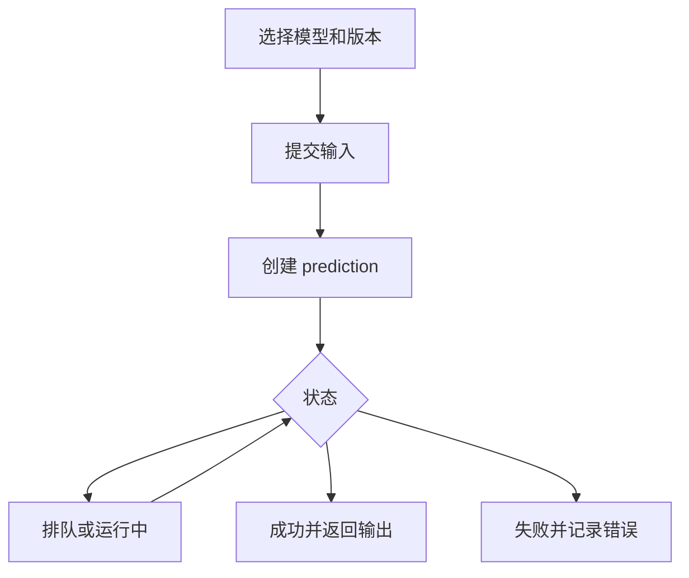

# Replicate：把模型当成 API 快速试用和部署

Replicate 解决的是“我想试一个模型，但不想先搭推理环境”的问题。它把许多开源或社区模型包装成可调用的 API，你可以先用 Prediction 跑通输入输出，再决定是否要做私有部署、固定版本和生产化治理。

## 你会做出什么

这篇更像一个短教程。读完后，你会理解 Replicate 的基本工作流：选模型，发起一次 prediction，读取结果，再根据是否要上线决定要不要使用 deployment、webhook 和版本锁定。

developer-roadmap 当前图谱节点是 `Replicate`，但同 ID 源文件标题是 `Qwen`。本章按图谱顺序写 Replicate；源文件链接仍保留在延伸阅读里，方便回溯这个映射差异。

## 准备工作

你需要一个明确的模型任务，例如生成图片、转录音频、给图片打标签，或者调用一个开源语言模型。还需要一个 API token，以及一组能代表真实使用场景的输入样例。

Replicate 的核心对象叫 prediction。一次 prediction 就是“用某个模型版本处理一次输入”。它可能很快完成，也可能排队、运行、失败或取消，所以你的代码要把它当成异步任务处理。

## 第一步：先用公开模型跑通一次 prediction

先在 Replicate 上选择一个模型，阅读模型页面里的输入字段、输出格式、许可证和示例。不要只看演示效果。模型页面通常会标出版本、硬件、运行时间和调用方式，这些信息会影响成本和上线风险。

调用时，你把模型版本和输入传给 API，得到一个 prediction ID。随后查询 prediction 状态，直到它变成 succeeded、failed 或 canceled。

这个流程会提醒你一件事：Replicate 不是普通同步函数调用。前端页面可以显示等待状态；后端任务要保存 prediction ID，方便重试、追踪和排查。

## 第二步：把试验变成可重复调用

试验阶段可以直接调用公开模型，但生产阶段要更严格。你要固定模型版本，记录每次输入输出，处理失败状态，并给长任务设置超时和用户提示。

如果一个模型会被稳定调用，可以考虑 deployment。Replicate 的 deployment 给模型提供专用 API 端点，也能控制实例数量。最小实例数可以减少冷启动，最大实例数可以限制成本上限。这个选择本质上是在用钱换延迟稳定性。

Webhook 适合长时间运行的任务。与其让服务端不断轮询 prediction 状态，不如让 Replicate 在任务完成时回调你的后端。这样更适合图片、视频、音频和较慢的模型推理。

## 刚才做了什么

你完成的不是“接入一个模型”这么简单，而是建立了一条外部模型调用链路：输入校验、异步任务、状态追踪、结果保存、失败处理和成本控制。Replicate 把模型运行环境藏在 API 后面，但这些工程问题仍然归你负责。

判断 Replicate 是否适合上线，可以看三件事：

- 模型许可证和输出风险是否适合你的产品。
- 延迟、失败率和成本是否能承受真实流量。
- 是否需要固定版本、专用 deployment、webhook 和降级方案。

## 下一步

下一章是 `Open AI Playground`。当你用 Replicate 试模型时，重点在“模型能不能跑起来”；到了 Playground，重点会变成“prompt、参数、结构化输出和评估怎么迭代”。

## 延伸阅读

- [Replicate Docs：Get started](https://replicate.com/docs/get-started)
- [Replicate Docs：Create a prediction](https://replicate.com/docs/topics/predictions/create-a-prediction)
- [Replicate Docs：Deployments](https://replicate.com/docs/topics/deployments/)
- [Replicate Docs：HTTP API](https://replicate.com/docs/reference/http/)
- [Replicate Docs：Webhooks](https://replicate.com/docs/topics/webhooks/)
- [Replicate Docs：Run models with Node.js](https://replicate.com/docs/get-started/nodejs)
- [nilbuild/developer-roadmap：qwen@c0RPhpD00VIUgF4HJgN2T.md](https://github.com/nilbuild/developer-roadmap/blob/master/src/data/roadmaps/ai-engineer/content/qwen%40c0RPhpD00VIUgF4HJgN2T.md)
