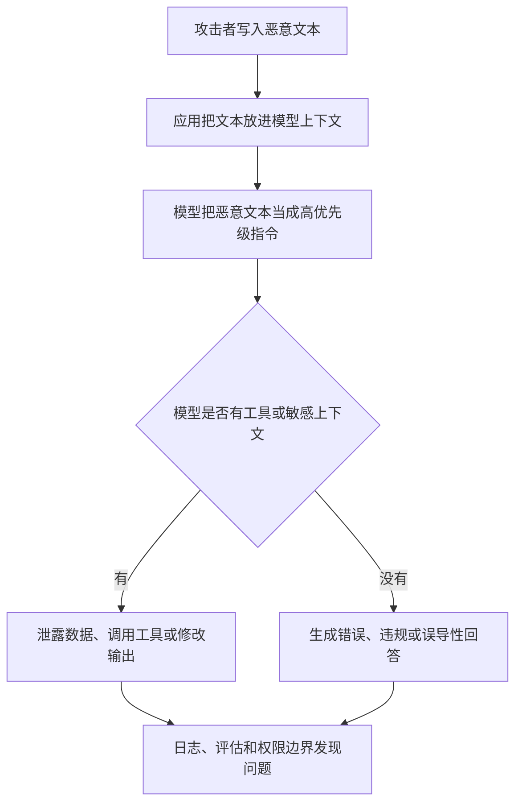

# Prompt Injection Attacks：恶意输入怎样改写模型行为

Prompt Injection Attacks 是把恶意指令混进用户输入、网页、文档或工具返回结果里，诱导模型忽略原本规则。它危险的地方不只是“回答变差”，而是模型可能泄露信息、误调用工具，或把攻击者的目标当成系统任务执行。

## 它解决什么安全问题

普通 Web 应用里，代码和数据边界比较清楚。LLM 应用里，用户输入、检索文档、系统指令和工具结果最后都会变成模型上下文的一部分。攻击者可以利用这个混合入口，把“请忽略上面的规则”伪装成一段普通文本。

developer-roadmap 对 Prompt Injection 的核心介绍是：攻击者通过构造欺骗性或对抗性内容，操纵语言模型产生非预期或有害输出，比如绕过过滤、泄露敏感信息，或改变模型行为。这个定义已经点出关键：攻击目标是模型的指令解释过程。

Prompt Injection 分为直接和间接两类。直接攻击来自用户当前输入；间接攻击藏在模型读取的外部内容里，比如网页、邮件、PDF、工单附件或搜索结果。AI Engineer 更容易低估间接攻击，因为攻击文本不是用户在输入框里亲手写的。

## 攻击链路长什么样

攻击通常不是一句“忽略规则”这么简单。更现实的链路会利用工具权限、长上下文和外部数据源，把模型一步步带到错误动作上。

如果模型只能生成一段文字，损害主要是内容质量和安全输出。如果模型能发邮件、查数据库、下单或改配置，Prompt Injection 就会变成应用安全问题。

## 防护思路

防护的第一步是承认“模型不会天然服从系统提示”。系统提示能提高正常场景下的行为一致性，但不能当作安全边界。真正的边界要放在代码、权限、数据隔离和工具调用策略里。

可以从四层入手：

- 输入层：标记外部内容来源，对不可信文本做隔离和长度限制。
- 上下文层：把系统规则、用户请求、检索材料和工具结果分区组织，不让外部文本伪装成开发者指令。
- 工具层：给工具最小权限，高风险动作走确认、审批或后端校验。
- 输出层：对敏感信息、越权动作和危险内容做检测，失败时返回可控结果。

不要把“请不要泄露密钥”写进 prompt 后就结束。密钥不该进入模型上下文，工具也不该把超出任务所需的数据交给模型。

## 工程里要注意的事

Prompt Injection 没有一次性补丁。模型、工具、检索源和业务流程一变，攻击面也会变。你要把它当成持续测试项目，而不是上线前跑一次清单。

评估集里要放真实攻击样例：越狱文本、伪装成文档说明的恶意指令、要求输出系统提示的请求、诱导模型调用工具的输入。每次改 prompt、换模型、接新数据源，都用同一批样例回归。

更关键的是权限设计。让模型“决定是否能做某事”通常不够稳；后端应该根据用户身份、资源权限和动作风险再次判断。模型可以建议动作，系统负责授权。

## 怎么开始防

从一条最小规则开始：任何来自用户、网页、文件、搜索结果和第三方工具的文本都按不可信处理。把它们明确包在“资料内容”区域里，不让它们混进系统规则。

然后检查你的工具调用。列出模型能访问的每个工具、每个工具能读写什么、最坏结果是什么。能只读就不要给写权限；能查一条记录就不要查整张表。

下一节 `Security and Privacy Concerns` 会把 Prompt Injection 放进更大的安全和隐私范围里：数据收集、训练、日志、权限、合规和用户信任都要一起看。

## 延伸阅读

- [OWASP：LLM01 Prompt Injection](https://genai.owasp.org/llmrisk/llm01-prompt-injection/)
- [Microsoft Security：How to defend your AI app against prompt injection](https://www.microsoft.com/en-us/security/blog/2025/08/28/how-to-defend-your-ai-app-against-prompt-injection/)
- [Prompting Guide：Prompt Injection](https://www.promptingguide.ai/prompts/adversarial-prompting/prompt-injection)
- [Wiz：What is a Prompt Injection Attack?](https://www.wiz.io/academy/prompt-injection-attack)
- [NVIDIA Developer：Securing LLM Systems Against Prompt Injection](https://developer.nvidia.com/blog/securing-llm-systems-against-prompt-injection/)
- [nilbuild/developer-roadmap：prompt-injection-attacks@cUyLT6ctYQ1pgmodCKREq.md](https://github.com/nilbuild/developer-roadmap/blob/master/src/data/roadmaps/ai-engineer/content/prompt-injection-attacks%40cUyLT6ctYQ1pgmodCKREq.md)
