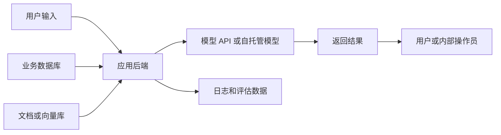

# Security and Privacy Concerns：AI 功能先守住数据边界

AI 安全和隐私不是上线前加一个免责声明。只要模型会接触用户数据、内部文档、日志或工具权限，你就要设计数据边界：哪些数据能进模型，谁能看输出，模型能做什么，失败后怎么发现。

## 它解决什么问题

传统应用的安全重点通常是身份、权限、输入校验和数据存储。AI 应用多了一层不确定性：模型会根据上下文生成答案，也可能把上下文里的敏感信息带到输出里。你不能只保护数据库，还要保护进入模型的每一段上下文。

developer-roadmap 对这一节的核心介绍是：AI 的安全和隐私关注数据保护与负责任使用，尤其是敏感数据在收集、处理和存储过程中的安全，防止未经授权访问、数据泄露、模型误暴露隐私、数据滥用、偏见和透明度不足。

换成工程语言，就是你要同时管住三件事：数据流、模型行为和人类可追踪性。数据流回答“数据去了哪里”；模型行为回答“模型会不会说错或泄露”；可追踪性回答“出事后能不能定位原因”。

## 数据流先画出来

安全设计最好从数据流开始，而不是从工具清单开始。把用户输入、业务数据库、向量库、模型 API、日志系统和人工审核入口都画出来，标出哪些地方会出现个人信息、商业机密或凭证。

这张图不需要漂亮，但要具体。只要某个节点会保存数据，就写清保存多久、谁能访问、是否脱敏、是否会用于训练或评估。

## 工程里要注意的事

第一类风险是敏感信息进入模型上下文。比如用户把身份证号粘进聊天框，检索系统把整份合同塞给模型，或工具返回了比任务所需更多的字段。减少上下文里的敏感数据，比事后过滤输出更稳。

第二类风险是日志和评估数据。很多团队会把模型请求、响应和失败样例记录下来做调试。这些日志很有价值，但也可能复制一份新的敏感数据仓库。日志要有脱敏、访问控制和保留周期。

第三类风险是工具权限。能查数据的模型已经是一个应用入口；能写数据的模型更像一个自动化操作员。权限要按用户身份、资源范围和动作风险做后端校验，不要只靠 prompt 约束。

第四类风险是供应商和部署边界。使用云端模型 API 时，要看数据保留、训练使用、区域、审计、加密和企业控制项。自托管模型减少了第三方传输，但会把基础设施、补丁、访问控制和监控责任转回你自己。

## 怎么开始做安全基线

先列出你的 AI 功能会处理的数据类型。把数据分成公开信息、内部信息、个人信息、凭证和受监管数据。每类数据写一个处理规则：能不能进入 prompt，能不能落日志，能不能发给外部模型。

然后给模型工具做最小权限。读操作和写操作分开，普通回答和高风险动作分开。删除、付款、发消息、改权限这类动作要让后端做显式校验，并保留审计记录。

最后补评估和监控。安全评估不只测“回答是否有害”，还要测是否泄露系统提示、是否输出不该出现的个人信息、是否在无权限时调用工具、是否把不确定内容说成事实。

## 对你意味着什么

0 到 3 年经验的开发者最容易把 AI 安全理解成“加一段更严厉的系统提示”。系统提示有用，但它不是权限系统，也不是隐私合规方案。

更可靠的起步方式是：少给模型数据、少给模型权限、把关键动作留给代码判断。模型负责理解和生成，应用负责授权、记录和兜底。

下一步是 `Bias and Fairness`。安全和隐私主要保护数据边界；公平性会继续讨论模型输出对不同人群和场景是否稳定、是否造成系统性偏差。

## 延伸阅读

- [NIST：Artificial Intelligence Risk Management Framework](https://www.nist.gov/itl/ai-risk-management-framework)
- [NIST：AI RMF Generative AI Profile](https://www.nist.gov/itl/ai-risk-management-framework/generative-ai-profile)
- [OWASP：LLM02 Sensitive Information Disclosure](https://genai.owasp.org/llmrisk/llm02-sensitive-information-disclosure/)
- [Google：Secure AI Framework](https://saif.google/)
- [OpenAI Platform：Enterprise privacy](https://openai.com/enterprise-privacy/)
- [nilbuild/developer-roadmap：security-and-privacy-concerns@sWBT-j2cRuFqRFYtV_5TK.md](https://github.com/nilbuild/developer-roadmap/blob/master/src/data/roadmaps/ai-engineer/content/security-and-privacy-concerns%40sWBT-j2cRuFqRFYtV_5TK.md)
