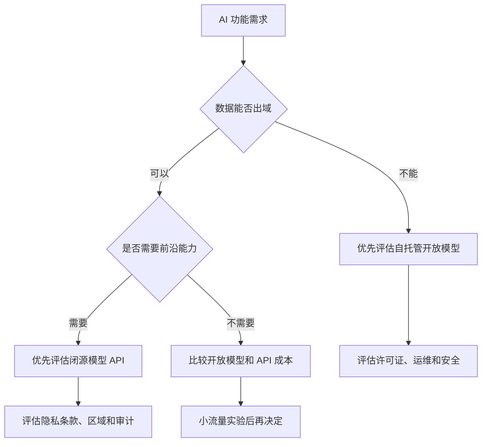

# Open vs Closed Source Models：控制权和省心程度的取舍

开源或开放权重模型给你更多控制权：能本地部署、能看许可证、能按自己的基础设施调优。闭源模型通常更省心：API 稳定、能力强、运维少，但你对权重、训练数据和内部安全机制的可见性有限。

## 为什么容易混淆

上一节的公平性让你看到：模型不是一个普通黑盒 API，它会影响评估、审计和责任边界。到了模型选型时，很多人会把“开源模型”“开放权重模型”“闭源 API”混在一起说。

developer-roadmap 对这一节的核心介绍是：开源模型可以自由获取、定制和协作，带来透明性和灵活性；闭源模型属于厂商专有，通常更容易使用，但限制了修改能力和透明度。

这里有一个细节：不少被日常称为“开源大模型”的模型，其实更准确地说是“开放权重模型”。它们开放了权重和推理使用方式，但训练数据、完整训练代码、许可证限制未必满足严格的 Open Source AI 定义。

## 各自在解决什么问题

开放模型适合你需要控制部署边界的场景。比如数据不能离开内网、延迟要贴近用户、推理成本要按硬件摊销，或者团队想研究模型行为并做更深的评估。

闭源模型适合你更想快速交付能力的场景。比如产品还在验证阶段，团队没有模型运维经验，或者你需要前沿多模态、工具调用、长上下文和企业级 SLA。

这不是信仰问题。对 AI Engineer 来说，模型形态首先是工程约束：数据能不能出域、延迟能不能接受、成本谁来承担、出问题时谁能定位。

## 关键差异

两个路线最大的差距不在“免费还是收费”，而在控制面。

| 维度 | 开源或开放权重模型 | 闭源模型 API |
| --- | --- | --- |
| 部署 | 可本地、自托管或私有云部署 | 通常调用厂商 API |
| 可见性 | 可查看权重、模型卡和部分实现 | 主要依赖厂商文档和合规承诺 |
| 定制 | 可做微调、量化、蒸馏和推理优化 | 定制能力由 API 能力决定 |
| 运维 | 需要自己处理显存、吞吐、扩缩容和监控 | 厂商承担大部分模型服务运维 |
| 成本 | 高峰期可能更可控，但有硬件和人力成本 | 按 token、请求或套餐计费 |
| 合规 | 数据边界更可控，许可证要细读 | 数据处理条款和区域能力要细读 |

表格里的“开源”不是绝对安全，“闭源”也不是天然不透明到不可用。开放模型如果许可证限制商业使用，或者团队没有安全补丁和监控能力，也会带来新的风险。闭源 API 如果提供企业隐私、审计、区域和数据保留控制，也能满足很多生产需求。

## 两者的关系

开源和闭源不是对立阵营，更像不同阶段的工具。一个团队可以先用闭源 API 验证产品价值，再把稳定、可预测、成本高的部分迁到开放模型。也可以把高风险数据留给自托管模型，把复杂推理交给闭源前沿模型。

常见的混合架构是：用小型开放模型处理分类、路由和格式化，用闭源模型处理复杂生成；或者用闭源模型做基线评估，再选一个开放模型做可控部署。

## 对你意味着什么

选模型时先问四个问题：数据能不能离开你的环境？团队有没有能力维护推理服务？这个功能是否真的需要最强模型？许可证和供应商条款是否允许你的用法？

如果答案偏向控制和数据边界，开放模型更值得评估。如果答案偏向速度、能力和少运维，闭源 API 更合适。真正成熟的工程选择，往往不是二选一，而是把不同模型放在合适的位置。

下一步是 `Popular Open Source Models`。你会看到几类常见开放模型家族，以及它们更适合哪些起步场景。

## 延伸阅读

- [Open Source Initiative：The Open Source AI Definition](https://opensource.org/ai/open-source-ai-definition)
- [IBM Think：Open source AI vs. closed AI](https://www.ibm.com/think/topics/open-source-ai-vs-closed-ai)
- [Hugging Face：Open LLM Leaderboard](https://huggingface.co/spaces/open-llm-leaderboard/open_llm_leaderboard)
- [Stanford CRFM：Foundation Model Transparency Index](https://crfm.stanford.edu/fmti/)
- [Andreessen Horowitz：Emerging Architectures for LLM Applications](https://a16z.com/emerging-architectures-for-llm-applications/)
- [nilbuild/developer-roadmap：closed-vs-open-source-models@RBwGsq9DngUsl8PrrCbqx.md](https://github.com/nilbuild/developer-roadmap/blob/master/src/data/roadmaps/ai-engineer/content/closed-vs-open-source-models%40RBwGsq9DngUsl8PrrCbqx.md)
