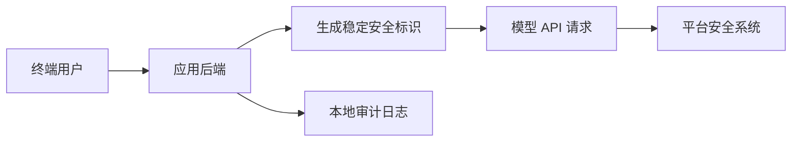

# Adding end-user IDs：用安全标识追踪滥用

给模型请求带上稳定的 end-user ID，不是为了把个人信息交给模型，而是为了在出现滥用时能定位到具体终端用户。更准确地说，现在 OpenAI 文档推荐使用 `safety_identifier`：传一个稳定、不可直接还原个人身份的标识，让平台和你的系统都能更快处理异常。

## 第一步：先选一个稳定但不暴露隐私的标识

developer-roadmap 对这一节的核心介绍是：在请求中发送终端用户 ID，可以帮助 OpenAI 监控和检测滥用；如果应用里出现政策违规，OpenAI 能给你的团队更可操作的反馈。

这里的关键不是“把用户名塞进 prompt”。prompt 是模型会读取的上下文，用户 ID 不该出现在那里。更合适的位置是 API 请求参数，比如 `safety_identifier`。这个值要稳定，但不要直接使用邮箱、手机号、真实姓名或数据库主键。

常见做法是对内部用户 ID 做哈希，再加上你自己的命名空间。这样同一个用户的请求能被串起来，外部系统又不能直接看出是谁。

## 第二步：把标识放进每次模型请求

安全标识只有持续发送才有用。登录用户、匿名设备、团队成员、API 客户都要有一致的规则，否则异常流量会混在一起。

如果用户没有登录，可以用匿名会话或设备级标识，但要设置过期策略。匿名标识不适合长期追踪一个人，更适合在短时间内发现刷接口、批量越狱、重复违规这类行为。

## 第三步：把标识接进你的风控和客服流程

安全标识的价值在出问题时才明显。平台检测到某个标识下有异常请求，你能快速查到本地日志、限流记录和用户动作，而不是只看到“整个组织的 API 调用异常”。

工程上可以把动作分成几档：

| 信号 | 本地动作 | 说明 |
| --- | --- | --- |
| 单次轻微命中 | 记录并返回普通安全提示 | 不急着封禁，先观察 |
| 短时间重复命中 | 限流或增加验证 | 避免一个用户影响整体服务 |
| 高风险命中 | 暂停相关功能并转人工 | 保留审计记录，减少误封 |
| 跨账号相似行为 | 检查批量注册或脚本滥用 | 结合 IP、设备和业务行为判断 |

不要把安全标识当成身份认证。它只是追踪和风控线索，真正的权限判断仍然要由你的登录系统、租户隔离和后端授权完成。

## 验证：怎么知道接对了

先检查 API 请求里是否真的带上了 `safety_identifier`，而且同一用户在不同请求中保持一致。然后检查日志：你应该能用这个标识查到请求时间、功能入口、moderation 结果和后续动作。

再做一次隐私检查。日志和请求里不应该出现明文邮箱、手机号、身份证号或真实姓名。安全标识要能帮助定位滥用，但不能变成新的个人信息泄漏点。

最后做一个故障演练：假设某个用户连续触发高风险内容，你能不能在几分钟内限流、联系内部负责人、查到关联请求，并避免影响其他正常用户。

## 延伸阅读

- [OpenAI Help Center：How to Incorporate a Safety Identifier](https://help.openai.com/en/articles/5428082-how-to-incorporate-a-safety-identifier)
- [OpenAI API：Safety best practices](https://developers.openai.com/api/docs/guides/safety-best-practices)
- [OpenAI API：Safety checks](https://developers.openai.com/api/docs/guides/safety-checks)
- [NIST Privacy Framework](https://www.nist.gov/privacy-framework)
- [OWASP：Logging Cheat Sheet](https://cheatsheetseries.owasp.org/cheatsheets/Logging_Cheat_Sheet.html)
- [nilbuild/developer-roadmap：adding-end-user-ids-in-prompts@4Q5x2VCXedAWISBXUIyin.md](https://github.com/nilbuild/developer-roadmap/blob/master/src/data/roadmaps/ai-engineer/content/adding-end-user-ids-in-prompts%404Q5x2VCXedAWISBXUIyin.md)
