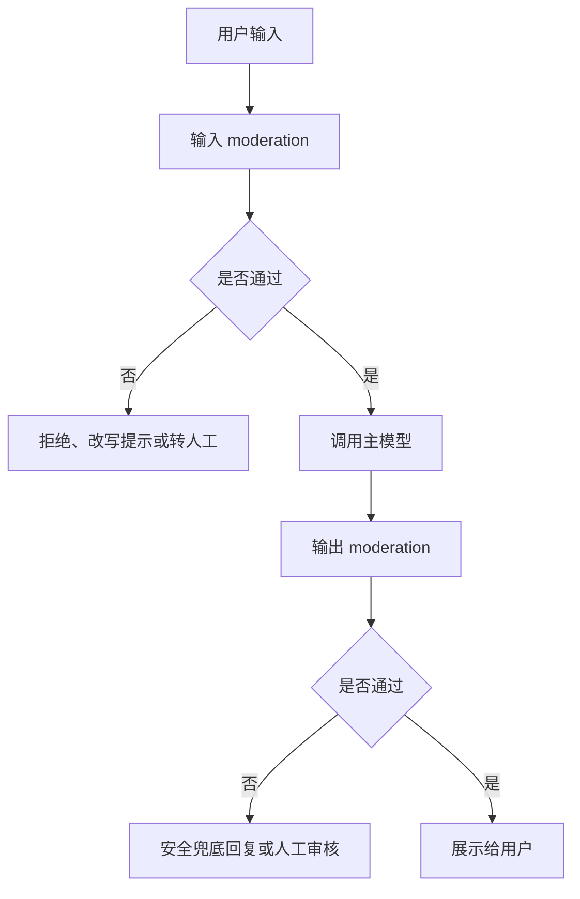

# OpenAI Moderation API：把内容安全检查接进链路

如果你的 AI 功能允许用户输入文本或图片，Moderation API 更像一层内容安全闸门：先判断输入或输出是否触碰平台政策，再决定放行、拒绝、降级还是转人工。它不能替你定义完整社区规则，但能把常见高风险内容拦在模型调用和用户展示之前。

## 第一步：先决定要检查哪里

developer-roadmap 对 Content Moderation APIs 的核心介绍是：这类 API 会自动分析文本、图片、视频和音频，识别可能有害或不合适的内容。它们用机器学习模型检测仇恨、暴力、自伤、性相关内容等政策类别，开发者可以根据结果过滤内容或采取处理动作。

落到 OpenAI Moderation API，你通常会检查两个位置：

- 输入检查：用户请求进入主模型之前，先判断是否要拒绝、改写或转人工。
- 输出检查：模型生成内容之后，再判断是否能展示给用户。

输入检查能减少模型被带偏的机会。输出检查能挡住模型自己生成的不安全内容。只做其中一个，链路仍然会有缺口。

## 第二步：把 moderation 结果映射成产品动作

Moderation API 返回的是分类和分数，不是你的产品规则。工程上更稳的做法是把结果转成自己的策略表。

| moderation 信号 | 产品动作 | 适合场景 |
| --- | --- | --- |
| 明确命中高风险类别 | 拒绝请求或隐藏输出 | 自伤、暴力细节、明显仇恨内容 |
| 分数接近阈值 | 转人工或要求用户改写 | 语境复杂、误伤成本高的场景 |
| 低风险但敏感 | 限制功能范围 | 教育、医疗、法律等高责任场景 |
| 未命中 | 正常进入下一步 | 普通问答、草稿、搜索辅助 |

不要把所有命中都处理成同一句“内容违规”。用户需要知道下一步怎么做：是换一种表达、删除敏感信息，还是等待人工审核。

## 第三步：放到真实调用链里

Moderation 最常见的位置是在主模型调用前后各跑一次。输入被拦截时，不再调用主模型；输出被拦截时，不直接展示给用户。

OpenAI Cookbook 的示例强调了输入和输出两侧都能检查。对延迟敏感的产品可以并行做输入检查和主模型调用，但只有在 moderation 通过后才展示结果。这样能省时间，也要准备好取消或丢弃已经生成的结果。

## 验证：怎么知道接对了

先准备一小组测试样例，覆盖正常输入、边界输入和明显违规输入。每条样例都要写清预期动作，而不是只看 API 是否返回成功。

验证时至少看四件事：

- 正常请求不会被大面积误伤。
- 明确违规请求不会进入主模型。
- 模型输出被拦截时，用户看到的是可理解的兜底提示。
- 日志里能看到 moderation 结果、动作和请求 ID，但不保存不必要的敏感原文。

Moderation 不是一次接入后就结束。产品场景、用户群体和模型输出风格变化后，阈值和动作也要复查。

## 延伸阅读

- [OpenAI API：Moderation](https://developers.openai.com/api/docs/guides/moderation)
- [OpenAI Cookbook：How to use the moderation API](https://developers.openai.com/cookbook/examples/how_to_use_moderation)
- [OpenAI API：Safety best practices](https://developers.openai.com/api/docs/guides/safety-best-practices)
- [Microsoft Learn：Azure AI Content Safety overview](https://learn.microsoft.com/en-us/azure/ai-services/content-safety/overview)
- [Google AI：Responsible Generative AI Toolkit](https://ai.google.dev/responsible)
- [nilbuild/developer-roadmap：content-moderation-apis@ljZLa3yjQpegiZWwtnn_q.md](https://github.com/nilbuild/developer-roadmap/blob/master/src/data/roadmaps/ai-engineer/content/content-moderation-apis%40ljZLa3yjQpegiZWwtnn_q.md)
