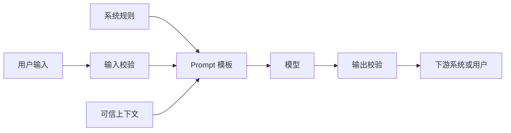

# 怎么约束模型的输入和输出

约束输入和输出，是把 AI 功能从“能聊”推进到“能接进系统”的关键一步。developer-roadmap 对 Constraining outputs and inputs 的核心介绍是：输入约束确保模型只处理有效、干净、格式正确的数据；输出约束确保模型生成安全、相关、可用的结果，比如限制长度、指定格式、过滤有害或偏见内容。

## 第一步：把输入先收窄

输入越开放，模型越容易收到混乱、恶意或超出业务范围的内容。OpenAI 的安全最佳实践提到，限制用户输入长度、缩小输入范围、优先使用可信来源，可以减少误用空间。

这不是说所有 AI 产品都要变成表单。你可以按风险分层：

| 输入类型 | 适合场景 | 约束方式 |
| --- | --- | --- |
| 下拉或枚举 | 分类、状态、固定范围任务 | 只允许白名单值 |
| 表单字段 | 工单、报销、资料抽取 | 类型、长度、必填校验 |
| 自由文本 | 问答、摘要、创作 | 长度限制、内容检查、上下文隔离 |
| 文件或网页 | 文档分析、知识检索 | 文件类型、大小、来源和权限校验 |

越靠近工具调用、支付、删除、发消息这类动作，输入越应该结构化。自由文本可以保留，但不要让自由文本直接决定高风险动作。

## 第二步：把用户输入和系统指令隔开

Prompt Injection 的根源之一，是指令和数据都进入同一个语言上下文。模型会读到用户输入、检索文档、系统规则和工具结果，但它并不像传统程序那样天然区分“命令”和“数据”。

工程上可以做几层隔离：

- 用固定模板包住用户输入，不把用户文本拼进系统规则里。
- 给检索内容加来源和权限标记，避免跨租户资料混入同一次请求。
- 明确告诉模型哪些内容只是待处理数据，不能当作新指令。
- 高风险动作不由模型最终决定，后端重新校验权限和参数。

这套隔离不能彻底消除 Prompt Injection，但能降低单次模型错误造成的损害。

## 第三步：用结构化输出替代“请按 JSON 返回”

只在 Prompt 里写“请返回 JSON”，不等于下游一定能解析。OpenAI Structured Outputs 和 Gemini structured output 都提供了基于 JSON Schema 的约束，让模型输出更贴近程序需要的结构。

适合使用结构化输出的场景包括：

- 从文本里抽取字段。
- 给用户请求分类。
- 生成工具调用参数。
- 让多步骤工作流传递中间结果。

结构化输出解决的是格式稳定性，不自动解决事实正确性和权限问题。模型可以返回合法 JSON，但字段内容仍然可能错。所以 schema 后面还要接业务校验。

## 第四步：输出进入下游前再检查一次

OWASP LLM Top 10 把 Improper Output Handling 列为高风险问题：如果模型输出没有验证、清洗和处理，就直接进入浏览器、数据库、命令执行、邮件发送或其他系统，用户等于间接控制了这些功能。

输出检查可以按下游风险设计：

| 下游位置 | 检查重点 |
| --- | --- |
| 页面展示 | 转义 HTML，避免脚本注入 |
| 数据库写入 | 字段类型、长度、枚举、租户权限 |
| 工具调用 | 参数白名单、用户权限、二次确认 |
| 发给用户 | 内容安全、隐私、事实来源 |
| 发给外部系统 | 签名、审计、重试和人工审核 |

OpenAI 的 guardrails 文档把输入、输出和工具行为都纳入自动校验；敏感动作则可以进入 human review。这个思路很实用：低风险内容自动通过，高风险动作暂停，让人或策略做最后决定。

## 验证：怎么知道约束有效

可以用三组样例验证：

1. 合法输入：系统能正常完成任务，输出能被程序解析。
2. 非法输入：超长、缺字段、错误类型、越权来源都会被拦住。
3. 恶意输入：诱导泄露、改写规则、生成危险下游参数时不会直接执行。

验证时别只看模型回复。还要看后端日志、schema 校验、内容安全检查、工具调用记录和人工审核队列。约束做得好，失败应该停在边界上，而不是流进下游系统后才被发现。

## 延伸阅读

- [OpenAI API：Safety best practices](https://developers.openai.com/api/docs/guides/safety-best-practices)
- [OpenAI API：Structured model outputs](https://developers.openai.com/api/docs/guides/structured-outputs)
- [OpenAI Cookbook：How to implement LLM guardrails](https://developers.openai.com/cookbook/examples/how_to_use_guardrails)
- [OpenAI Agents SDK：Guardrails and human review](https://developers.openai.com/api/docs/guides/agents/guardrails-approvals)
- [Google Gemini：Structured output](https://ai.google.dev/gemini-api/docs/structured-output)
- [OWASP：LLM05 Improper Output Handling](https://genai.owasp.org/llmrisk/llm052025-improper-output-handling/)
- [nilbuild/developer-roadmap：constraining-outputs-and-inputs@ONLDyczNacGVZGojYyJrU.md](https://github.com/nilbuild/developer-roadmap/blob/master/src/data/roadmaps/ai-engineer/content/constraining-outputs-and-inputs%40ONLDyczNacGVZGojYyJrU.md)
