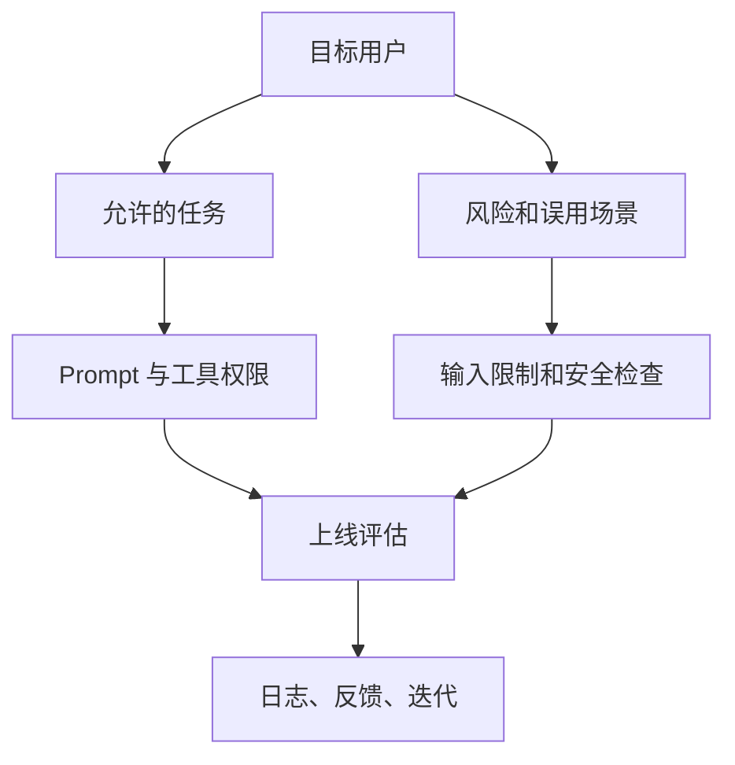

# Know your Customers / Usecases：先定义谁在什么场景下用

AI 功能的安全边界，往往不是从模型开始，而是从“谁会用、用来做什么、不能拿来做什么”开始。developer-roadmap 对 Know your Customers / Usecases 的核心介绍是：深入理解目标用户的需求、行为和期待，才能让工具贴合用途，同时通过清晰的功能边界减少误用和意外使用。

## 为什么用户和用例会影响安全

同一个模型能力，放进不同产品里，风险完全不同。一个面向内部客服的摘要工具，风险主要是隐私、越权和事实错误；一个面向公开用户的自动发帖工具，还会多出滥用、刷屏、诱导传播和品牌风险。

Google People + AI Guidebook 把问题问得很直接：你的用户是谁，他们重视什么，你要解决哪个问题，怎么判断体验已经足够好。AI Engineer 需要把这些产品问题翻译成工程边界。

| 你要弄清楚的事 | 工程里的落点 |
| --- | --- |
| 谁在用 | 登录、租户、角色、权限、速率限制 |
| 为什么用 | Prompt 模板、工具权限、可用数据源 |
| 什么时候用 | 风险场景、人工审核、失败兜底 |
| 不能怎么用 | 输入限制、输出限制、审计和封禁策略 |

如果这张表写不出来，后面的 Prompt、moderation、权限和测试都只能靠猜。

## 用例不是功能清单

“做一个客服 Agent”不是用例，它只是功能名。更有用的写法是：某类用户在某个上下文中，为了完成某个任务，需要系统读取哪些信息、允许做哪些动作、不能碰哪些边界。

例如：

| 粗略功能 | 更清楚的用例 |
| --- | --- |
| 客服 Agent | 已登录客服查看当前工单和公开帮助文档，生成回复草稿，不能直接退款 |
| 简历助手 | 求职者上传自己的简历，获得措辞建议，不能伪造经历 |
| 数据分析助手 | 内部运营查询聚合指标，不能返回单个用户的隐私数据 |
| 文案生成器 | 市场同事生成广告初稿，敏感行业内容进入人工审核 |

NIST AI RMF 反复强调 context of use，也就是系统被放进什么组织、流程、人群和环境里使用。这个上下文会改变风险优先级。对开发者来说，最实用的动作是给每个用例写一段“允许”和“不允许”。

## 把用户理解变成边界设计

知道用户和用例之后，要把它落到产品和代码里。只写在需求文档里不够，模型请求链路也要能感知这些边界。

边界可以从四个地方落地：

- UI：用表单、下拉、确认框减少用户输入里的自由发挥。
- API：按角色限制工具调用和数据访问。
- Prompt：明确当前任务、可用资料和拒绝规则。
- 审计：记录用户、入口、输入类型、输出结果和安全命中。

Learn Prompting 的角色提示资料可以帮助你把“谁在说话、模型扮演什么角色、输出给谁看”写清楚。但角色提示不是权限系统。模型说“我是客服主管”不代表它真的拥有退款权限，真正的权限仍然在后端。

## 对你意味着什么

做 AI 功能前，先写一页用例卡，比直接调模型更省时间。用例卡可以很短，但要回答几个问题：

- 目标用户是谁？
- 用户要完成哪一个具体任务？
- 模型可以读取哪些数据？
- 模型可以建议什么动作，不能执行什么动作？
- 哪些输出需要人工确认？
- 失败后用户应该看到什么？

Microsoft Responsible AI Impact Assessment Template 也采用类似思路：识别预期用途、利益相关方、潜在收益和潜在伤害。你不需要一开始就做完整评估，但这个方向很适合转成团队里的轻量 checklist。

## 怎么开始用

从下一个 AI 功能开始，先别写 Prompt。先写三句话：

1. 这个功能服务哪类用户。
2. 这个功能只解决哪一个任务。
3. 这个功能不能被用来做什么。

然后把这三句话变成测试样例。正常用户能顺利完成任务；越界请求会被拒绝或转人工；不确定场景不会被模型硬答。这样做出来的系统通常没那么“炫”，但更容易上线、维护和解释。

## 延伸阅读

- [Google People + AI Guidebook：User Needs + Defining Success](https://pair.withgoogle.com/guidebook/chapters/user-needs-and-defining-success)
- [NIST：AI Risk Management Framework](https://www.nist.gov/itl/ai-risk-management-framework)
- [NIST：AI RMF Core](https://airc.nist.gov/airmf-resources/airmf/5-sec-core/)
- [Microsoft：Responsible AI Impact Assessment Template](https://blogs.microsoft.com/wp-content/uploads/prod/sites/5/2022/06/Microsoft-RAI-Impact-Assessment-Template.pdf)
- [Learn Prompting：Assigning Roles](https://learnprompting.org/docs/basics/roles)
- [nilbuild/developer-roadmap：know-your-customers--usecases@t1SObMWkDZ1cKqNNlcd9L.md](https://github.com/nilbuild/developer-roadmap/blob/master/src/data/roadmaps/ai-engineer/content/know-your-customers--usecases%40t1SObMWkDZ1cKqNNlcd9L.md)
