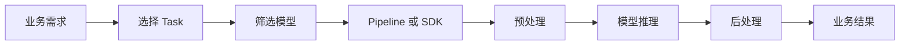

# Hugging Face Tasks：先按任务找模型

Hugging Face Tasks 是找模型时的第一层分类。你不是先问“哪个模型最强”，而是先问“我要做的是分类、摘要、问答、图像理解，还是语音识别”。任务选对了，后面读模型卡、试跑样例和部署评估才有方向。

## 它解决什么问题

前面你已经学过开放模型和模型供应商。到了 Hugging Face 生态，模型数量会突然变多：同一个页面里可能有文本模型、图像模型、音频模型、多模态模型，还有不同大小、不同许可证、不同训练数据的版本。

developer-roadmap 对 Hugging Face Tasks 的核心介绍是：Hugging Face 支持文本分类、命名实体识别、问答、摘要、翻译，也支持视觉问答、图文匹配这类同时处理文本和图像的多模态任务。每个任务都可以由不同预训练模型完成，并能通过 Hugging Face 库访问和微调。

这段话的工程含义很直接：Task 是模型和需求之间的接口。先把需求翻译成任务类型，再去找对应模型；不要拿一个聊天模型硬做所有事。

## 常见任务在解决什么事

Hugging Face 的任务列表很长，但你可以先按输入输出形态理解。文本分类把一段文本映射到标签；问答从上下文里找答案；摘要把长文本压缩成短文本；翻译把一种语言转成另一种语言；命名实体识别从文本里标出人名、地点、组织、时间等片段。

图像和多模态任务也是同样思路。图像分类给图片打标签；目标检测找出图片里的物体位置；视觉问答根据图片和问题生成答案；图文匹配判断文本和图片是否描述同一件事。

| 任务 | 输入 | 输出 | 适合场景 |
| --- | --- | --- | --- |
| Text Classification | 一段文本 | 一个或多个标签 | 情感分析、工单分类、内容审核 |
| Token Classification | 一段文本 | 每个 token 或片段的标签 | 命名实体识别、敏感字段标注 |
| Question Answering | 问题和上下文 | 答案片段或答案文本 | 文档问答、客服知识库 |
| Summarization | 长文本 | 短摘要 | 会议纪要、文章摘要、工单压缩 |
| Translation | 源语言文本 | 目标语言文本 | 多语言内容处理 |
| Image Classification | 图片 | 标签 | 商品识别、缺陷初筛 |
| Visual Question Answering | 图片和问题 | 文本答案 | 图像理解、报表截图问答 |

这个表不是为了背术语，而是帮你把需求拆小。比如“帮客服处理用户反馈”不是一个任务，它可能包含情感分类、主题分类、摘要和回复生成。

## Task、Pipeline 和模型的关系

Hugging Face Transformers 里的 pipeline 把“任务名、模型、预处理、推理、后处理”包成一个高层接口。你传入任务名和模型，pipeline 会帮你处理 tokenizer、输入格式和输出结构。

pipeline 适合快速验证。它能让你很快知道某个模型在某类输入上大概能不能工作。到了生产系统，还要继续处理批量推理、错误重试、延迟、监控、版本锁定和输入输出校验。

## 工程里要注意的事

任务名相同，不代表模型表现相同。一个文本分类模型可能只在英文评论上训练，放到中文客服工单里就会失准。一个摘要模型可能适合新闻，不适合合同或医疗文本。

模型页面上的 task 标签也不是质量保证。标签只能说明发布者把模型归到这个任务下。你还要看模型卡里的训练数据、评估指标、许可证、语言覆盖、限制和维护状态。

还有一个常见问题：一个产品功能经常不是单一任务。比如“自动处理报销邮件”可能先做邮件分类，再抽取金额和日期，最后生成结构化结果。每一步都可以选不同任务和模型，不必把所有逻辑压进一个大模型调用里。

## 怎么开始用

第一次用 Hugging Face Tasks，可以先拿一个小需求练手：

1. 把需求写成一句话，比如“把用户评论分成正面、负面、中性”。
2. 找到对应任务，比如 Text Classification。
3. 在 Hugging Face Tasks 或 Models 页面按任务筛选。
4. 选一个模型卡完整、下载量较高、许可证清楚的模型。
5. 用 10 到 20 条真实样例试跑，记录失败输入。

这一步的目标是建立任务意识。你越早把需求拆成明确任务，越容易判断该用现成模型、微调模型、商业 API，还是普通规则系统。

## 延伸阅读

- [Hugging Face：Tasks](https://huggingface.co/tasks)
- [Hugging Face Transformers：Task summary](https://huggingface.co/docs/transformers/en/task_summary)
- [Hugging Face Transformers：Pipelines](https://huggingface.co/docs/transformers/en/main_classes/pipelines)
- [Hugging Face Course：Using pipelines](https://huggingface.co/learn/llm-course/chapter1/3)
- [Hugging Face Optimum：Tasks Manager](https://huggingface.co/docs/optimum/en/exporters/task_manager)
- [Hugging Face Computer Vision Course：Multimodal tasks and models](https://huggingface.co/learn/computer-vision-course/en/unit4/multimodal-models/tasks-models-part1)
- [nilbuild/developer-roadmap：hugging-face-tasks@YKIPOiSj_FNtg0h8uaSMq.md](https://github.com/nilbuild/developer-roadmap/blob/master/src/data/roadmaps/ai-engineer/content/hugging-face-tasks%40YKIPOiSj_FNtg0h8uaSMq.md)
