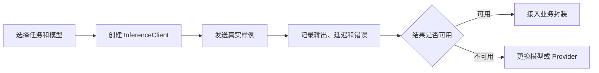

# 怎么用 Hugging Face Inference SDK 接入托管推理

Hugging Face Inference SDK 适合在你不想先搭 GPU 服务时，把 Hub 上的模型当成 API 调用。它的重点不是“本地加载模型”，而是通过 `InferenceClient` 用统一接口访问不同任务、不同模型和不同推理提供方。

## 第一步：先确认适合用托管推理

developer-roadmap 对 Inference SDK 的核心介绍是：Hugging Face Inference SDK 让开发者更容易集成并运行托管在 Hugging Face Hub 上的大语言模型推理。通过 `InferenceClient`，你可以向不同模型发起 API 调用，处理文本生成、图像生成等任务。SDK 支持同步和异步操作，因此能接入不同工作流。

这类接入适合三种情况：

- 你要快速验证某个 Hub 模型，不想先部署服务。
- 你的流量还不稳定，暂时不值得自建推理集群。
- 你希望在同一套代码里尝试不同 Inference Providers。

如果你有强隐私、极低延迟、固定大流量或深度自定义推理栈需求，自部署或专用 Inference Endpoint 可能更合适。SDK 只是入口，不替你解决所有生产问题。

## 第二步：选模型和 Provider

`InferenceClient` 可以面向 Hub 模型发起推理请求。Hugging Face 文档把它放在一个更大的推理体系里：serverless providers、dedicated managed infrastructure 和 local inference servers。不同 provider 支持的任务、模型、价格、延迟和区域不完全一样。

选型时先看四件事：

| 判断点 | 要确认什么 |
| --- | --- |
| 任务 | 文本生成、图像生成、分类、Embedding 等任务是否被支持 |
| 模型 | 模型是否能通过目标 provider 推理 |
| 成本 | 按请求、按 token、按运行时间或按专用资源计费 |
| 数据边界 | 请求会发到哪个服务，日志和数据保留策略是什么 |

不要只看 SDK 能不能调用成功。你还要确认 provider 的服务等级、鉴权方式、错误码、限流、超时和重试策略。

## 第三步：用最小调用验证

先用最小代码验证模型和任务，再接入业务。Python 侧通常使用 `huggingface_hub` 里的 `InferenceClient`；JavaScript 侧可以使用 `@huggingface/inference`。不同语言的参数细节会变，但工程顺序相同：鉴权、指定模型、发送输入、读取输出、处理错误。

最小验证不要只跑一条“你好”。准备几条真实输入：正常输入、边界输入、空输入、超长输入、你担心会失败的输入。这样你能早点看到模型能力和 API 行为。

## 第四步：把 SDK 调用包成业务边界

SDK 不应该散落在业务代码各处。更稳的做法是包一层自己的服务函数，把模型名、provider、超时、重试、日志和输出校验放在一起。

这层边界至少处理：

- 请求超时和 provider 限流。
- 模型输出为空、格式不对或内容不可用。
- 模型版本和 provider 配置记录。
- 失败样例采集，方便后续评估。
- 敏感输入的脱敏和审计。

异步调用适合批量任务或高并发接口，但异步不等于无限并发。你还要根据 provider 限制、预算和业务优先级做队列、退避和降级。

## 验证：怎么知道可以继续往下接

完成最小接入后，用一张表记录验证结果：

| 项目 | 通过标准 |
| --- | --- |
| 任务匹配 | 输出解决了原始需求，不只是格式正确 |
| 稳定性 | 多组真实样例没有明显随机失控 |
| 性能 | 延迟和吞吐能接受，有超时处理 |
| 成本 | 估算过单次请求和月度成本 |
| 安全 | 输入输出有校验，敏感数据有边界 |

这一步通过后，再考虑接入产品流程。否则你可能只是把一个 Demo 包成了线上依赖。

## 延伸阅读

- [Hugging Face Hub Python Library：InferenceClient](https://huggingface.co/docs/huggingface_hub/en/package_reference/inference_client)
- [Hugging Face Docs：Inference Providers](https://huggingface.co/docs/inference-providers/en/index)
- [Hugging Face Docs：Inference Endpoints](https://huggingface.co/docs/inference-endpoints/en/index)
- [Hugging Face Hub Python Library：Inference guide](https://huggingface.co/docs/huggingface_hub/en/guides/inference)
- [npm：@huggingface/inference](https://www.npmjs.com/package/%40huggingface/inference)
- [Hugging Face Docs：Tasks](https://huggingface.co/tasks)
- [nilbuild/developer-roadmap：hugging-face-inference-sdk@3kRTzlLNBnXdTsAEXVu_M.md](https://github.com/nilbuild/developer-roadmap/blob/master/src/data/roadmaps/ai-engineer/content/hugging-face-inference-sdk%403kRTzlLNBnXdTsAEXVu_M.md)
