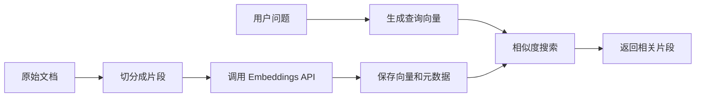

# OpenAI Embedding Models：把文本变成可检索的语义坐标

OpenAI Embedding Models 解决的是“怎样把文本变成可比较的向量”。你把问题、文档片段或商品描述送进 Embeddings API，得到一串数字；再用向量距离找相近内容，就能做语义搜索、聚类、推荐、去重和检索增强。

## 它解决什么问题

developer-roadmap 对 OpenAI Embeddings API 的核心介绍是：它能把文本转换成名为 embeddings 的数值向量表示。这些向量捕捉文本的语义含义，让你通过分析向量之间的关系完成语义搜索、聚类和相似度比较。API 把训练和维护 embedding 模型的复杂度藏起来，让工程师可以直接生成向量。

关键词搜索看字面，Embedding 搜索看语义。用户搜“员工电脑坏了怎么办”，文档里写的是“设备维修申请流程”，关键词可能对不上；Embedding 模型会把两段文本放到相近的语义区域，检索系统就有机会把正确文档找出来。

## 工作原理

一次最小的 Embedding 链路通常是这样：

OpenAI 的 embedding 模型会输出固定维度的向量。你不需要理解每一维的含义，只要知道两个向量越接近，模型认为它们语义越相关。真正的工程难点不在“生成向量”这一步，而在切分、过滤、排序和评估。

这里有一个边界：向量相似不等于事实正确。Embedding 模型能帮你找到相近内容，但不会自动判断资料是否过期、用户是否有权限查看、片段是否足以回答问题。这些仍然要由应用层处理。

## 怎么选模型和参数

OpenAI 目前常见选择是 `text-embedding-3-small` 和 `text-embedding-3-large`。简单理解：small 更便宜、速度和成本友好；large 通常适合对召回质量更敏感的场景。最终选择要看你的评估集，而不是只看模型名字。

选型时先看这几件事：

| 判断点 | 怎么看 |
| --- | --- |
| 任务 | 搜索、聚类、分类、推荐的评估方式不同 |
| 语言 | 中文、英文、代码或行业术语要用真实数据测试 |
| 成本 | 文档入库、增量更新和查询都会消耗 token |
| 存储 | 向量维度会影响数据库存储和索引成本 |
| 更新 | 文档变化后要能重新生成向量并淘汰旧版本 |

如果你已经在前面章节理解过 Embedding，这一节的重点就是把概念落到 OpenAI API：模型、输入、输出向量、token 成本和向量数据库连接方式都要一起设计。

## 工程里要注意的事

第一，文档切分会直接影响召回质量。片段太短，问题需要的上下文可能被拆散；片段太长，向量会混进太多主题。先用真实问题跑小评估集，比一开始纠结理论 chunk 大小更有用。

第二，元数据过滤不能省。部门、权限、时间、来源、产品线、语言，这些字段应该和向量一起写入数据库。很多线上事故不是向量找不到内容，而是找到了用户不该看的内容。

第三，评估要看结果，不只看相似度分数。你可以准备几十个真实问题，标出理想命中文档，再比较不同模型、切分策略和重排方式。相似度分数只能辅助判断，不能替代业务评估。

## 怎么开始用

最小起步可以分成四步：

1. 选一小批真实文档，清洗掉导航、页脚和重复内容。
2. 按自然段或标题层级切分，保留来源、标题和权限字段。
3. 调用 Embeddings API 生成文档向量，写入向量数据库。
4. 对用户问题也生成向量，检索 Top K 片段，再人工检查命中结果。

如果这一步命中质量不稳定，先调切分和过滤，再考虑换模型。模型升级能改善表示能力，但不会自动修复脏数据、过期文档和权限设计。

## 延伸阅读

- [OpenAI Docs：Embeddings](https://platform.openai.com/docs/guides/embeddings)
- [OpenAI API Reference：Create embeddings](https://platform.openai.com/docs/api-reference/embeddings/create)
- [OpenAI：New embedding models and API updates](https://openai.com/index/new-embedding-models-and-api-updates/)
- [OpenAI Cookbook：Semantic text search using embeddings](https://cookbook.openai.com/examples/semantic_text_search_using_embeddings)
- [OpenAI Cookbook：Vector databases examples](https://cookbook.openai.com/examples/vector_databases/readme)
- [OpenAI Help：What is the API context window?](https://help.openai.com/en/articles/8984337-what-is-the-openai-api-context-window)
- [nilbuild/developer-roadmap：open-ai-embeddings-api@l6priWeJhbdUD5tJ7uHyG.md](https://github.com/nilbuild/developer-roadmap/blob/master/src/data/roadmaps/ai-engineer/content/open-ai-embeddings-api%40l6priWeJhbdUD5tJ7uHyG.md)
