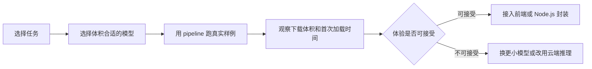

# 怎么用 Transformers.js 在浏览器或 Node.js 里跑模型

Transformers.js 适合把 Hugging Face 模型直接放进前端、浏览器扩展或 Node.js 脚本里试用。它的核心价值不是替代所有云端推理，而是在低延迟、离线可用和数据不出端这几类场景里，给你一个更轻的模型运行路径。

## 第一步：先判断适不适合端侧推理

developer-roadmap 对 Transformers.js 的介绍是：它是一个 JavaScript 库，可以让 Hugging Face 这类 transformer 模型直接在浏览器或 Node.js 中运行，不依赖云服务。它支持文本生成、情感分析、翻译等任务，并借助 WebAssembly 和高效 JavaScript 在 Web 应用或服务端脚本里提供 NLP 能力。

这类方案适合先从小模型和明确任务开始：

| 场景 | 为什么适合 Transformers.js |
| --- | --- |
| 浏览器内文本分类 | 用户输入不必发到后端，延迟也更短 |
| 离线工具 | 网络不可用时仍能完成基础推理 |
| 前端 Demo | 不必先准备 GPU 服务和后端接口 |
| Node.js 批处理 | 用同一种 JavaScript 生态跑轻量模型 |

如果任务需要大模型、长上下文、高并发或严格的吞吐保障，云端推理、专用端点或自建推理服务通常更稳。端侧推理最怕把“能跑起来”误当成“适合生产流量”。

## 第二步：从 Pipeline 跑通一个真实任务

Transformers.js 延续了 Transformers 生态里的 `pipeline` 思路：你给出任务名和模型，库负责加载模型、Tokenizer、预处理和后处理。对初学者来说，pipeline 是最短的验证路径。

一个常见接入顺序是：

验证时不要只用一句英文短文本。准备你真实会遇到的输入：中文、长文本、空文本、混合符号、用户可能乱写的文本。Transformers.js 能支持多种任务，但每个任务对输入格式、模型大小和运行设备的要求都不一样。

## 第三步：处理模型加载和缓存

端侧模型的第一个工程问题是加载。模型权重、Tokenizer、配置文件都要下载，浏览器还要受网络、缓存、内存和设备性能限制。首次加载慢、移动端内存不足、公司网络拦截模型文件，这些都比算法本身更早影响用户体验。

你可以先做三件事：

- 选体积更小或量化后的模型。
- 在产品流程里给模型加载留出明确状态。
- 把失败、超时和降级路径写进同一层封装。

Transformers.js 文档里还提供了环境配置能力，可以控制模型来源、本地模型、缓存和远程加载行为。浏览器里跑模型时，不要把这些当成可选细节；它们会直接影响启动速度和隐私边界。

## 第四步：再考虑 WebGPU

WebGPU 能让部分模型推理利用 GPU，但它不是一个“打开就一定变快”的开关。你要确认浏览器支持、模型是否适配、数据类型是否合适，以及不同设备上的结果是否稳定。

更实用的顺序是先跑通 CPU 或 Wasm 路径，再用 WebGPU 做性能优化。这样即使某些用户设备不支持 WebGPU，应用也有可用的回退方案。

## 验证：怎么知道可以继续接入产品

把 Transformers.js 接进真实界面前，至少记录下面几项：

| 项目 | 通过标准 |
| --- | --- |
| 首次加载 | 模型下载和初始化时间在用户可接受范围内 |
| 推理延迟 | 常见输入不会让界面长时间卡住 |
| 输出质量 | 真实样例能解决任务，不只是示例跑通 |
| 设备覆盖 | 低配电脑和目标浏览器上有回退方案 |
| 数据边界 | 用户输入、模型文件来源和缓存策略清楚 |

通过这些检查后，再把模型调用包成业务函数。不要让组件直接到处创建 pipeline，否则缓存、错误处理和模型版本很快会失控。

## 延伸阅读

- [Hugging Face Docs：Transformers.js](https://huggingface.co/docs/transformers.js/en/index)
- [Hugging Face Docs：Transformers.js Pipelines](https://huggingface.co/docs/transformers.js/en/pipelines)
- [Hugging Face Docs：Transformers.js in Vanilla JavaScript](https://huggingface.co/docs/transformers.js/en/tutorials/vanilla-js)
- [Hugging Face Docs：WebGPU in Transformers.js](https://huggingface.co/docs/transformers.js/en/guides/webgpu)
- [Hugging Face Docs：Transformers.js Environment Variables](https://huggingface.co/docs/transformers.js/en/api/env)
- [npm：@huggingface/transformers](https://www.npmjs.com/package/%40huggingface/transformers)
- [nilbuild/developer-roadmap：transformersjs@bGLrbpxKgENe2xS1eQtdh.md](https://github.com/nilbuild/developer-roadmap/blob/master/src/data/roadmaps/ai-engineer/content/transformersjs%40bGLrbpxKgENe2xS1eQtdh.md)
